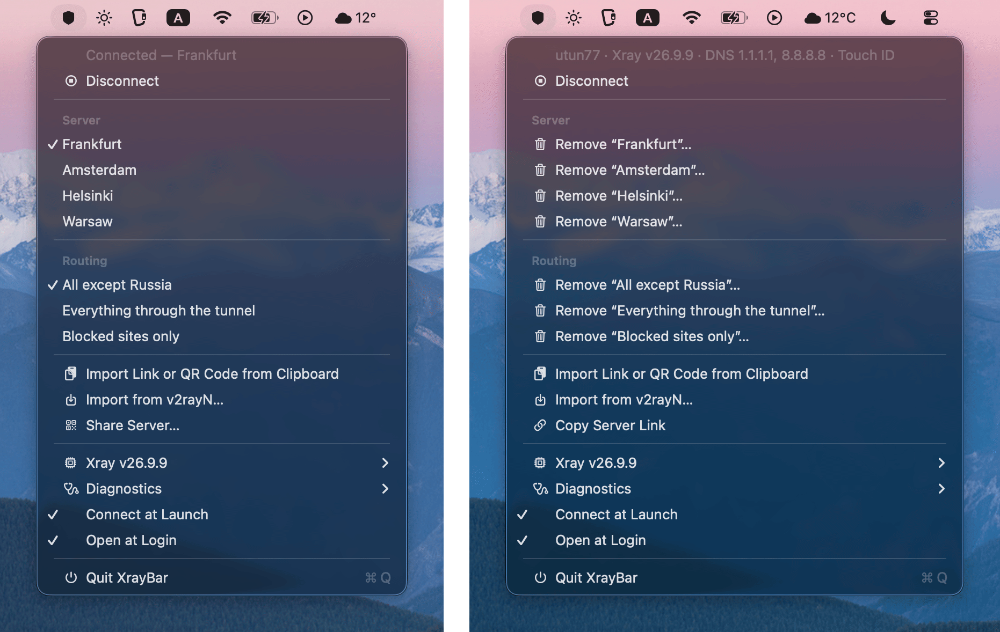

# XrayBar

**English** · [Русский](README.ru.md)

A small, native macOS menu-bar app that runs [Xray-core](https://github.com/XTLS/Xray-core)
with its **native TUN**: all traffic, routed by geosite/geoip rules, through one process,
with nothing else in between.

<p align="center">
  
</p>
<p align="center"><sub>The menu, and the same menu with <b>Option</b> held (demo servers).</sub></p>

> Status: early; used daily by the author. Not done yet: IPv6 through
> the tunnel verified on a real IPv6 network, verified behaviour across sleep/wake and network switches, transports other than raw.

## How this was built — read this first

XrayBar was written almost entirely by an AI coding agent (Claude Code), directed by the
author in conversation: what is often called *vibe coding*. The author is **not a Swift or
macOS developer** and does not know Apple's development practices (Swift, SwiftUI/AppKit,
the SDKs, signing, launchd) well enough to judge the code as an expert would.

What the author did: decided what the app should and should not do, insisted on a small,
auditable design, and tested every step on a real Mac (macOS 26) with real servers. What was
done to make up for the missing expertise: every decision and its evidence is written down
([docs/DECISIONS.md](docs/DECISIONS.md)), including the mistakes; the code is small and meant to
be read in order; there are tests and a deterministic audit script ([scripts/audit.sh](scripts/audit.sh)).

What it means for you: **no experienced macOS engineer has reviewed this code.** It may be
unidiomatic, and it may be wrong in ways neither the author nor the AI noticed. Treat it as
you would any unreviewed code that asks for your administrator password: read it or have it
reviewed ([docs/AUDIT.md](docs/AUDIT.md)) before you trust it. Reviews and issues from people who
know the platform are very welcome.

## Why

macOS clients for Xray tend to be multi-core kitchen sinks, look nothing like a Mac app,
or both. XrayBar does one thing and tries to do it the way Apple would:
a menu like Wi-Fi's, a password prompt when it needs root, and nothing left behind
when you disconnect. See [docs/PRINCIPLES.md](docs/PRINCIPLES.md).

## Build and install

Requirements: macOS 15+, Command Line Tools (`xcode-select --install`). No Xcode.

```sh
scripts/make-app.sh                          # builds build/XrayBar.app (ad-hoc signed)
cp -R build/XrayBar.app /Applications/       # then open it from /Applications
```

For development, `swift run` works too (English only: translations need the app bundle).
The interface follows the system language: English or Russian.

## Getting started

1. **Add a server.** *Import Link or QR Code from Clipboard*: copy a `vless://…` link, or press
   ⌘⇧⌃4 and select a QR code (the screenshot goes to the clipboard). Or *Import from v2rayN…*
   (read-only).
2. **Get Xray and routing data.** *Xray › Download v26.9.9* and *Update Routing Data*
   (checksum-verified). Installing Xray asks for your password once: it goes into a root-owned
   folder, the only place XrayBar runs it from as root. With v2rayN installed, *Copy Xray
   from v2rayN…* does the same with its copy; until then the routing data comes from v2rayN.
3. **Connect.** macOS asks for your administrator password: a TUN interface needs root.
   *Use Touch ID to Connect…* installs a small root-owned helper once; after that, Touch ID once per login.
4. **Forget about it.** *Connect at Launch* (on by default) plus *Open at Login*: the Mac starts,
   you touch the sensor, you're connected.

## The menu

| Item | What it does |
|---|---|
| Server, Routing | Choose the server and routing set (routing sets use v2rayN's format) |
| Share Server… | The selected server as a QR code |
| Xray › | Versions side by side; a new version's first connection is checked, with a one-click switch back. Routing data source and update. *Exclude from Tunnel…* for networks that must bypass Xray |
| Diagnostics › | Log, detailed log, data folder, uninstall the helper. XrayBar's own log: Console.app, subsystem `io.github.heaprip.xraybar` |
| **Option** held | *Remove* a server or routing set · *Copy Server Link* · technical details under the status line |

Only short, readable code runs as root: [the session script](Sources/XrayBar/Resources/xraybar-session.sh),
[the install script](Sources/XrayBar/Resources/xraybar-install.sh) and
[the helper](Sources/XrayBarHelper/main.swift): the session uses its event watch (it only
observes), and its Touch ID service is optional.

## Can I trust it?

You shouldn't have to take anyone's word for it. The app is ~1,500 lines of Swift in a handful of
numbered files meant to be read in order, plus ~260 lines of root scripts and a
~150-line root helper, with zero dependencies.

- [docs/SECURITY.md](docs/SECURITY.md) — what it does, threat model, known limitations.
- `scripts/audit.sh` — deterministic inventory of privilege, processes, network, file writes.
- [docs/AUDIT.md](docs/AUDIT.md) — review checklist, usable as instructions for an AI model.

## Tests

```sh
scripts/test.sh                 # unit tests
scripts/test.sh --integration   # also runs configs from your local v2rayN through xray (read-only)
```

## License and credits

MIT, see [LICENSE](LICENSE). Behaviour and formats are modelled on
[v2rayN](https://github.com/2dust/v2rayN) (no v2rayN code is used). Xray-core is a separate
program under MPL-2.0. Routing data:
[runetfreedom/russia-v2ray-rules-dat](https://github.com/runetfreedom/russia-v2ray-rules-dat),
[Loyalsoldier/v2ray-rules-dat](https://github.com/Loyalsoldier/v2ray-rules-dat).
