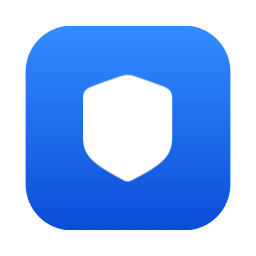

<p align="center"></p>
<h1 align="center">XrayBar</h1>
<p align="center">Небольшое нативное приложение для строки меню macOS для нативного TUN в Xray-core.</p>
<p align="center">
  <a href="https://github.com/heaprip/xraybar/actions/workflows/ci.yml"></a>
  <a href="https://github.com/heaprip/xraybar/releases"></a>
  
  <a href="LICENSE"></a>
</p>
<p align="center"><a href="README.md">English</a> · <b>Русский</b></p>

Небольшое нативное приложение для строки меню macOS, которое запускает
[Xray-core](https://github.com/XTLS/Xray-core) с его **нативным TUN**: весь трафик с
маршрутизацией по geosite/geoip идёт через один процесс, без посредников.

<p align="center">
  
</p>
<p align="center"><sub>Меню и то же меню с зажатым <b>Option</b> (демо-серверы).</sub></p>

> Статус: ранний; автор пользуется им каждый день. Ещё не проверено: IPv6 через туннель в
> реальной IPv6-сети, перенос DNS при смене сетевого сервиса (Wi-Fi на Ethernet).
> Не сделано: транспорты кроме raw.

## Как это сделано — прочитайте в первую очередь

XrayBar почти целиком написан ИИ-агентом для программирования (Claude Code) под руководством
автора в формате диалога — то, что часто называют *vibe coding*. Автор **не разработчик на Swift
и не macOS-разработчик** и не знает практики разработки под платформы Apple (Swift,
SwiftUI/AppKit, SDK, подпись, launchd) настолько, чтобы оценить код как специалист.

Что делал автор: решал, что приложение должно и не должно делать, настаивал на маленьком и
проверяемом устройстве и проверял каждый шаг на настоящем Mac (macOS 26) с настоящими
серверами. Чем компенсировалась нехватка экспертизы: каждое решение и его обоснование записаны
([docs/DECISIONS.md](docs/DECISIONS.md)), включая ошибки; код небольшой и рассчитан на чтение по
порядку; есть тесты и детерминированный скрипт аудита ([scripts/audit.sh](scripts/audit.sh)).

Что это значит для вас: **этот код не проверял опытный macOS-разработчик.** Он может быть
неидиоматичным и может содержать ошибки, которых не заметили ни автор, ни ИИ. Относитесь к нему
как к любому непроверенному коду, который просит пароль администратора: прочитайте его или
отдайте на проверку ([docs/ru/AUDIT.md](docs/ru/AUDIT.md)), прежде чем доверять. Ревью и issues от
людей, знающих платформу, очень приветствуются.

## Зачем

Клиенты Xray для macOS обычно либо комбайны из нескольких ядер, либо выглядят совсем
не как приложения для Mac, либо и то и другое. XrayBar делает одну вещь и старается делать
её так, как сделала бы Apple: меню как у Wi-Fi, запрос пароля, когда нужен root, и ничего
не остаётся после отключения. См. [docs/ru/PRINCIPLES.md](docs/ru/PRINCIPLES.md).

## Установка

Нужно: macOS 15 или новее, Apple silicon или Intel. Интерфейс следует языку системы:
английский или русский (ниже пункты меню названы как в русском).

1. Скачайте `XrayBar-x.y.z.pkg` (или `.zip`) из [последнего релиза](https://github.com/heaprip/xraybar/releases/latest).
2. Откройте его. XrayBar подписан ad hoc и не нотаризован (платного Apple Developer ID нет),
   поэтому в первый раз macOS откажет: нажмите **Готово**, затем **Системные настройки ›
   Конфиденциальность и безопасность**, найдите *«XrayBar… заблокирован»*, **Всё равно
   открыть**, подтвердите. Для `.pkg` это нужно один раз на загрузку; установленное им в
   /Applications приложение потом открывается как обычно.
3. Обновление: сначала завершите XrayBar. После обновления macOS один раз спросит, можно ли
   XrayBar пользоваться своей записью в связке ключей: **Всегда разрешать**. Если в меню
   появится *Обновить помощник (требуется)…*, выберите его.

Проверка скачанного (по желанию). Контрольные суммы лежат в релизе; аттестация доказывает, что
файл собран [workflow выпуска](.github/workflows/release.yml) этого репозитория из коммита с
тегом, а не загружен вручную:

```sh
shasum -a 256 -c SHA256SUMS
gh attestation verify XrayBar-x.y.z.pkg -R heaprip/xraybar
```

### Сборка из исходников

Хватит Command Line Tools (`xcode-select --install`), Xcode не нужен:

```sh
scripts/make-app.sh                          # собирает build/XrayBar.app (ad-hoc подпись)
cp -R build/XrayBar.app /Applications/       # и запускайте из /Applications
```

Для разработки подойдёт и `swift run` (только по-английски: переводам нужен бандл приложения).

## Первый запуск

1. **Добавьте сервер.** *Импорт ссылки или QR-кода из буфера обмена*: скопируйте ссылку
   `vless://…` или нажмите ⌘⇧⌃4 и выделите QR-код (снимок попадёт в буфер обмена). Или
   *Импорт из v2rayN…* (только чтение).
2. **Скачайте Xray и данные маршрутизации.** *Xray › Скачать v26.9.9* и *Обновить данные
   маршрутизации* (с проверкой контрольных сумм). Установка Xray один раз спрашивает пароль: он попадает в
   каталог, принадлежащий root, — единственное место, откуда XrayBar запускает его от root.
   Если установлен v2rayN, *Скопировать Xray из v2rayN…* делает то же с его копией; данные
   маршрутизации до обновления берутся из v2rayN.
3. **Подключитесь.** macOS спросит пароль администратора: для TUN-интерфейса нужен root.
   *Подключаться по Touch ID…* один раз устанавливает небольшой помощник, принадлежащий root;
   дальше достаточно Touch ID один раз после входа в систему.
4. **Забудьте о нём.** *Подключаться при запуске* (включено по умолчанию) и *Открывать при входе*: Mac
   включился, вы приложили палец — подключено.

## Меню

| Пункт | Что делает |
|---|---|
| Сервер, Маршрутизация | Выбор сервера и набора правил (наборы в формате v2rayN) |
| Поделиться сервером… | Выбранный сервер в виде QR-кода |
| Xray › | Версии рядом друг с другом; первое подключение с новой версией проверяется, откат в одно нажатие. Источник и обновление данных маршрутизации. *Исключить из туннеля…* для сетей в обход Xray |
| Диагностика › | Лог, подробный лог, папка с данными, удаление помощника. Собственный лог XrayBar: Console.app, подсистема `io.github.heaprip.xraybar` |
| С **Option** | *Удалить* сервер или набор правил · *Скопировать ссылку на сервер* · технические подробности под строкой статуса |

Под root выполняется только короткий читаемый код: [скрипт сессии](Sources/XrayBar/Resources/xraybar-session.sh),
[скрипт установки](Sources/XrayBar/Resources/xraybar-install.sh) и
[помощник](Sources/XrayBarHelper/main.swift): сессия использует его наблюдение за событиями (оно
только наблюдает), а его служба для Touch ID необязательна.

## Удаление

1. Отключитесь, затем *Диагностика › Удалить помощник…*, если вы его устанавливали (удаляет
   помощник, его LaunchDaemon и правило авторизации).
2. Завершите XrayBar и удалите его из /Applications (пункт «Открывать при входе» уйдёт вместе с ним).
3. Что остаётся:
   ```sh
   sudo rm -rf "/Library/Application Support/XrayBar" /var/db/xraybar  # установленный Xray, сохранённый DNS
   rm -rf ~/Library/Application\ Support/XrayBar                       # серверы, наборы правил, данные
   sudo pkgutil --forget io.github.heaprip.xraybar                      # если ставили из .pkg
   ```
   и запись *XrayBar server credentials* в связке ключей («Связка ключей»). `/var/run/xraybar`
   очищается при перезагрузке.

## Решение проблем

- **Нет интернета после сбоя или отключения питания.** Откройте XrayBar: он предложит
  *Восстановить сетевые настройки*. Вручную: `networksetup -setdnsservers Wi-Fi empty`.
- **«Другой VPN или TUN уже направляет весь трафик».** Выключите другой VPN или режим TUN в v2rayN.
- **На иконке в строке меню восклицательный знак.** Выберите *Обновить помощник (требуется)…*:
  приложение обновилось, а root-помощник ещё нет.
- **При открытии ничего не появляется.** Приложение уже запущено (только один экземпляр):
  посмотрите в строке меню или сначала завершите его.
- **Логи.** *Диагностика › Показать лог Xray*, а собственный лог XrayBar:
  `log show --last 1h --predicate 'subsystem == "io.github.heaprip.xraybar"'`. В issue укажите
  версию macOS, версию XrayBar (*О программе XrayBar*) и нужные строки лога, убрав адреса серверов.

## Можно ли ему доверять?

Верить на слово не нужно. Приложение — это около 1650 строк Swift в нескольких пронумерованных файлах, которые
читаются по порядку, плюс около 260 строк root-скриптов и root-помощник
примерно на 150 строк, без зависимостей.

- [docs/ru/SECURITY.md](docs/ru/SECURITY.md) — что делает приложение, модель угроз, известные ограничения.
- `scripts/audit.sh` — детерминированная опись: привилегии, процессы, сеть, запись файлов.
- [docs/ru/AUDIT.md](docs/ru/AUDIT.md) — чек-лист проверки, пригодный как инструкция для ИИ-модели.
- Сборки релизов делает CI с аттестацией происхождения (см. «Установка»); или соберите сами.

## Тесты

```sh
scripts/test.sh                 # модульные тесты
scripts/test.sh --integration   # плюс прогон конфигов из вашего v2rayN через xray (только чтение)
```

## Лицензия и благодарности

MIT, см. [LICENSE](LICENSE). Поведение и форматы повторяют
[v2rayN](https://github.com/2dust/v2rayN) (код v2rayN не используется). Xray-core — отдельная
программа под MPL-2.0. Данные маршрутизации:
[runetfreedom/russia-v2ray-rules-dat](https://github.com/runetfreedom/russia-v2ray-rules-dat),
[Loyalsoldier/v2ray-rules-dat](https://github.com/Loyalsoldier/v2ray-rules-dat).
